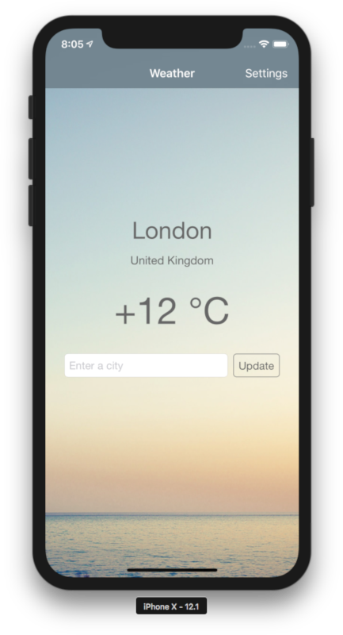

#  Weather

This is a simple weather application for iOS. It displays weather in a city that you enter in
a text field and remembers it after relaunch. Temperature units can be changed in settings.

Weather data is fetched from the [OpenWeatherMap](https://openweathermap.org) API.

